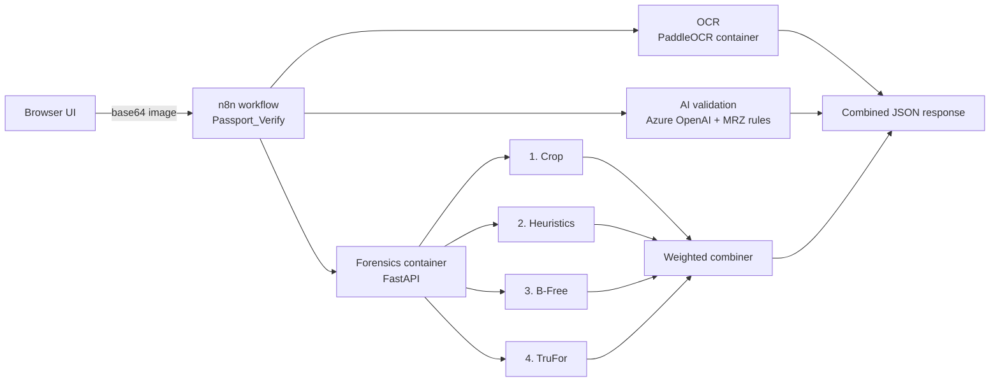

# Passport Verification

OCR, AI validation and forensic image analysis for passport images, built as a layered pipeline so that an edited or synthetic document is caught even when its text and MRZ look valid.

> **Decision support, not authentication.** Scores describe *image manipulation risk*. A low score does not prove a document is genuine, and a high score is a reason for human review.

## Why a forensic layer

MRZ checksums and field validation only look at **content**. A passport whose name, date or photo was edited in an image editor can still pass every content check, as long as the MRZ was edited to match. Pixel-level forensics catches what content checks cannot.

In testing, an edited passport scored **approved** by OCR and MRZ validation but **high** forensic risk (combined 0.70), while the clean original scored **low** (0.18).

## Architecture



The forensic result is **additional evidence**: it never blocks the validation flow, and if the forensic service is unavailable the response says so explicitly.

## Forensic pipeline

| Stage | What it does | Notes |
|---|---|---|
| 1. Crop (`crop.py`) | OpenCV document extraction: edges, contours, 4-point perspective warp, aspect-ratio check against the ICAO data page (≈1.42) | If no confident rectangle is found, the original is returned unchanged. Used for display; models analyse the original upload |
| 2. Heuristics (`heuristics.py`) | Tile sharpness, error-level analysis, noise residual; a tile is flagged only when **two cues agree** | Deliberately lenient so a bad photo is not mistaken for forgery. Excludes the spine, borders and non-content tiles |
| 3. B-Free | DINOv2 ViT classifier for AI-generated or inpainted images, scored on 5 crops | Probability is **not calibrated**, so it carries a lower weight |
| 4. TruFor | Noiseprint++ CNN plus a transformer fusing RGB and noise features; outputs a per-pixel tamper map, confidence map and image score | Score is the max of the pooled score and a *localized* score, so a small edit is not diluted by a large clean page |

### Combined verdict

`combine_scores.py` takes a weighted sum of the raw scores, with no cross-image baseline:

| Component | Weight |
|---|---|
| TruFor | 0.5 |
| B-Free | 0.3 |
| Heuristics | 0.2 |
| Model disagreement bonus | 0.1 |

Combined ≥ **0.55** → `high`, ≥ **0.30** → `elevated`, otherwise `low`. If a model stage fails the verdict becomes **"cannot assess — review required"** and is never reported as low. Weights are hand-set because there is no labelled passport dataset to fit a classifier.

## Repository layout

| Path | Contents |
|---|---|
| `PassportPipeline/` | Forensic stages, combiner, justification text, local CLI `run_pipeline.py` |
| `TruFor/` | Upstream [TruFor](https://github.com/grip-unina/TruFor) plus the `passport_trufor.py` wrapper and local patches |
| `BFree/` | Upstream [B-Free](https://github.com/grip-unina/B-Free) code plus the `passport_bfree.py` wrapper |
| `deploy/` | Forensic API (`api.py`, `Dockerfile`) and `deploy.sh` for Azure Container Apps |
| `deploy/paddle_ocr/` | PaddleOCR service exposing a Document Intelligence-compatible async API |
| `frontend/` | Web UI in `public/`, Vercel function and config, local dev server |

## Not in this repository

- **Model weights.** Download TruFor (`trufor.pth.tar`) and B-Free (`model_epoch_best.pth`) from their upstream repos. Place them at `TruFor/TruFor_train_test/pretrained_models/` and `BFree/weights/BFREE_dino2reg4/`.
- **Passport images and per-image results.** They are personal data and are git-ignored (`Samples/`, `passport_dataset/`, `VerificationResults/`).
- **Secrets.** API keys live in Azure Container App secrets and n8n credentials.

## Quick start

### Run the forensic pipeline locally

TruFor and B-Free need different Python environments (conda `trufor` on Python 3.7 and `bfree` on Python 3.10).

```bash
python PassportPipeline/run_pipeline.py --image path/to/passport.jpg --output VerificationResults
```

It writes a per-image folder with `combined_result.json`, `justification.md`, the TruFor heatmap and overlay, and the heuristic flags.

### Run the UI locally

```bash
cd frontend
N8N_WEBHOOK_URL=<your n8n webhook URL> python server.py   # http://localhost:8080
```

The local server proxies uploads to the webhook. Set `N8N_API_KEY` if the webhook requires an `API` header.

## Services and API

### Forensics (`deploy/api.py`)

| Endpoint | Description |
|---|---|
| `GET /health` | Confirms both Python environments can import torch |
| `POST /verify` | Multipart field `file`, header `X-API-Key`. Returns `combined_result`, `justification` and base64 PNGs (`trufor_overlay`, `trufor_heatmap`, `heuristics_flags`, …) |

Each request runs in a temporary directory that is deleted before the response is sent. Nothing is stored.

### OCR (`deploy/paddle_ocr/app.py`)

Reproduces the Document Intelligence `prebuilt-layout` flow so downstream parsing is unchanged: `POST …/documentModels/{model}:analyze` returns 202 with an `Operation-Location`, and a GET on that URL returns `{status, analyzeResult:{pages[words, lines, polygons, spans], content}}`. Auth accepts `Ocp-Apim-Subscription-Key` or `X-API-Key`. Results are kept in memory for 10 minutes, so run a single replica.

## Deploy

### Backend on Azure

```bash
az login
bash deploy/deploy.sh
```

Creates the resource group, container registry, Container Apps environment and the forensic app, with an API key stored as a secret. The forensic container needs **4 vCPU and 8 GiB**: TruFor is killed at 2 vCPU / 4 GiB. Set `--min-replicas 1` if you want to avoid cold starts, which can fail large uploads with a `507` from the ingress.

### UI on Vercel

1. Import this repository and set **Root Directory** to `frontend`.
2. Add the environment variable `N8N_WEBHOOK_URL`.
3. Allow the Vercel origin in the n8n webhook's CORS setting, and enable header auth before sharing the link.

The page reads the webhook from `/api/config` and calls it from the browser. A server-side proxy is not used because runs take several minutes and uploads exceed Vercel's request size limit.

## Limitations

- CPU inference takes roughly 2–4 minutes per image, more when requests overlap. A GPU would cut model time but needs a GPU workload profile and CUDA builds.
- TruFor was trained on natural photos, not passports. A real face photo can show a large anomaly (a known false-positive pattern), and heavy recompression weakens the noise traces it relies on.
- B-Free scores whole-image generation and inpainting traces. It will not reliably flag a conventional edit on a real background.
- OCR uses Latin-script models only, so Arabic or Hindi text may be misread. MRZ lines are unaffected.
- Thresholds were tuned on a small set of synthetic and sample images, not a labelled production dataset.

## Licences

TruFor and B-Free are research code from the GRIP group (University of Naples Federico II) under their own licences, which restrict commercial use. Review them before using this outside research.
